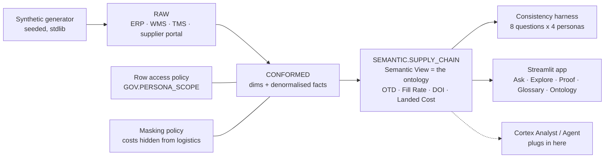

# OntoFlake — Governed Supply Chain Ontology & Conversational Analytics on Snowflake

> **Snowflake CoCo CLI Hackathon 2026 · Challenge 5: Supply Chain Ontology and Governed Conversational Analytics**
> Team **OntoFlake-AI**
>
> **Live app:** https://ontoflake-y2n9kim3odh66hkhdn7zfa.streamlit.app/

One ontology. One definition per metric. One answer for every persona.

Supply chain data is scattered across ERP, logistics, supplier and IoT systems with inconsistent definitions, so the
same question yields different answers across teams. OntoFlake encodes a supply chain ontology
(**Supplier → Part → Plant → Purchase Order → Shipment → Inventory → Sales Order → Customer**) as a governed
**Snowflake Semantic View**, layers row-access and masking policies on top, and proves — with an automated harness —
that planning, procurement and logistics get the *identical* number for the same metric.

## What's here

```
ontology/ontology.yaml         Source of truth: entities, relationships, hierarchies, canonical metrics, personas
data/generate.py               Seeded synthetic generator (stdlib only) - 160k rows across 10 tables, realistic anomalies
sql/00_setup.sql               Database, schemas, stage, warehouse
sql/01_raw_tables.sql          RAW: 1:1 source extracts
sql/02_load.sql                COPY INTO from stage
sql/03_conformed.sql           CONFORMED: ontology-shaped dims + denormalised facts
sql/04_semantic_view.sql       SEMANTIC.SUPPLY_CHAIN - the ontology as a Semantic View (9 entities, 13 relationships, 20 metrics)
sql/05_governance.sql          Persona roles, row-access policy, cost masking, tags, grants
sql/06_app_service_user.sql    Read-only key-pair identity for the public app
sql/golden_queries.sql         The canonical questions, expressed as SEMANTIC_VIEW() queries
harness/golden_questions.yaml  Persona x question matrix definition
harness/consistency_check.py   Runs every question as every persona; asserts identical answers; persists to GOV.CONSISTENCY_RUN
app/streamlit_app.py           Streamlit app (runs in Snowflake or on Streamlit Community Cloud)
scripts/deploy.ps1             One-command deploy of everything above
```

## Architecture



## The four challenge requirements, and where each is met

| Requirement | Where |
|---|---|
| Define the ontology: entities, relationships, hierarchies, canonical metrics (OTD, fill rate, DOI, landed cost) | [`ontology/ontology.yaml`](ontology/ontology.yaml) - every metric has an owner, grain and one formula |
| Encode as semantic views so business meaning drives answers | [`sql/04_semantic_view.sql`](sql/04_semantic_view.sql) - synonyms + business comments on every metric and dimension |
| Governed conversational layer, cross-domain questions, one consistent answer | App **Ask** tab routes business language to governed metrics via the semantic view's synonyms and shows the SQL as evidence. Cortex Analyst drops into the same slot. |
| Same metric resolves identically across personas (planning, procurement, logistics) | [`harness/consistency_check.py`](harness/consistency_check.py) - real `USE ROLE`, real policies. **32/32 cells pass.** Live in the app's **Consistency Proof** tab. |

### What "identical" means here

| Persona | Scope | Cost visibility | Expectation |
|---|---|---|---|
| `SC_PLANNING` | global | yes | byte-identical to baseline |
| `SC_PROCUREMENT` | global | yes | byte-identical to baseline |
| `SC_LOGISTICS` | global | **masked** | identical, cost metrics return `NULL` - never a different number |
| `SC_LOGISTICS_APAC` | APAC plants only | masked | equals the global answer filtered to APAC |

Definitions never change per persona. Only *visibility* does, and it is enforced by Snowflake policies, not by the app.

## Canonical metrics (excerpt)

| Metric | Grain | Definition |
|---|---|---|
| Supplier OTD % | inbound shipment | quantity-weighted % of received qty delivered on/before PO promised date |
| Customer OTD % | sales order line | quantity-weighted % of shipped qty delivered on/before requested date |
| Fill Rate % | sales order line | shipped / ordered; backorders are not filled |
| Days of Inventory | inventory position | on-hand qty / trailing-90-day daily demand qty |
| Landed Cost per Unit | inbound shipment | (material + freight + duty + insurance + handling) / received qty |

Full glossary with formulas and synonyms: `DESCRIBE SEMANTIC VIEW ONTOFLAKE.SEMANTIC.SUPPLY_CHAIN`, or the app's **Metric Glossary** tab.

## Run it yourself

Prerequisites: Python 3.11+, [Snowflake CLI](https://docs.snowflake.com/developer-guide/snowflake-cli/index), a Snowflake account with `ACCOUNTADMIN`.

```powershell
python -m venv .venv; .\.venv\Scripts\pip install snowflake-cli -r requirements.txt
copy config\connections.toml.example config\connections.toml   # fill in account / user / password
.\scripts\setup-connection.ps1                                  # installs into ~/.snowflake and tests
.\scripts\deploy.ps1                                            # data -> ontology -> governance -> proof -> app
```

`deploy.ps1` is idempotent. Steps: `00 01 put 02 03 04 05 harness app`. Use `-Steps` to run a subset, `-Regenerate` to rebuild the synthetic data.

Ask a question directly in SQL:

```sql
SELECT * FROM SEMANTIC_VIEW(
  ONTOFLAKE.SEMANTIC.SUPPLY_CHAIN
  DIMENSIONS plant.plant_region, carrier.transport_mode
  METRICS    shipment.supplier_otd_pct, shipment.landed_cost_per_unit
);
```

### Run the app

* **Streamlit in Snowflake**: `cd app; snow streamlit deploy --replace` (or `deploy.ps1 -Steps app`).
* **Streamlit Community Cloud**: main file **`streamlit_app.py`** (repo root - it delegates to `app/streamlit_app.py`), Python **3.11**,
  paste `.streamlit/secrets.toml` (see `secrets.toml.example`). The app authenticates as `ONTOFLAKE_APP_SVC` / `SC_APP_VIEWER`
  with key-pair auth - read-only, no passwords. Do not point Cloud at `app/` directly: `app/environment.yml` is the
  Streamlit-in-Snowflake conda spec and Cloud would pick it up instead of `requirements.txt`.
* **Local**: `streamlit run streamlit_app.py` (uses `.streamlit/secrets.toml`, else `~/.snowflake/connections.toml`).

## Data

100% synthetic, generated by `data/generate.py` with a fixed seed. 60 suppliers · 400 parts · 6 plants across
NA / EMEA / APAC / LATAM · 120 customers · 30k PO lines · 34.6k inbound shipments · 50k sales order lines ·
41.9k month-end inventory positions (Jan 2025 - Jun 2026). Anomalies are deliberate: high-risk suppliers are
systematically late, C-class and phase-out parts short-ship, air freight costs 2.5x, cross-border receipts carry duty.

## Roadmap (Cortex layer)

The semantic view already carries the synonyms and comments Cortex Analyst needs. When Cortex is enabled on the account:

1. `cortex analyst` over `SEMANTIC.SUPPLY_CHAIN` replaces the synonym router in the **Ask** tab.
2. Cortex Search over synthetic supplier contracts / SLAs; a Cortex Agent orchestrates Analyst + Search.
3. An ontology MCP server (metric definitions, lineage, persona consistency check) registered with CoCo CLI.

## License

MIT
